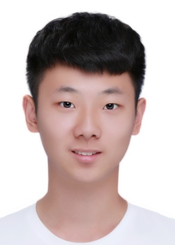

  

  	

  	  

        <h4>Kaixuan Wang</h4>
        
GRADUATE STUDENT

         
<i class='fa fa-envelope' ></i>  casey_wang1209@tju.edu.cn

      

        

        Kaixuan Wang is a graduate student in intelligent medical engineering at Tianjin University. Kaixuan got his bachelor's degree of intelligent medical engineering at Tianjin University.

        

  	

  

