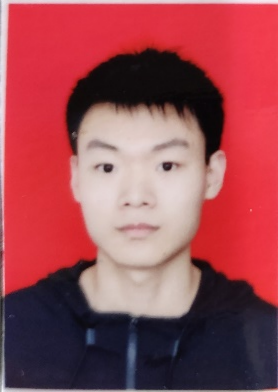

  

  	

  	  

        <h4>Qihang Xu</h4>
        
GRADUATE STUDENT

         
<i class='fa fa-envelope' ></i>  xqh@tju.edu.cn

      

        

        Qihang Xu  is a graduate student in intelligent medical engineering at Tianjin University. Qihang received his bachelor's degree of engineering at Tianjin University. Qihang's current research direction is mainly machine learning of antibodies.

        

  	

  

